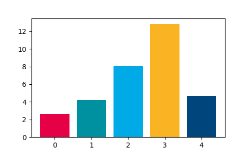
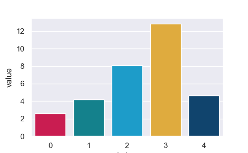

**TL;DR:** You can find the full code at the end of this post.

Most of the time, the colormaps in matplotlib and seaborn are sufficient for my needs. However, sometimes I want to use a
custom colormap. For example, when I want to use the colors of my institute in my plots, which I know they prefer
when it comes to publications and internal presentations. In this post, I will show you how to use custom colormaps in
matplotlib and seaborn using the colors from the corporate design of my institute as an example.

I am sure, there is more than one way to create custom colormaps, but this is how I do it.

### 1. Import the necessary packages

```python
import matplotlib as mpl
from matplotlib.colors import ListedColormap
import seaborn as sns
import numpy as np
from cycler import cycler
```
Don't bother about how to install the cycler package. It should be installed by default with matplotlib.

### 2. Define the colors
I got the colors from the corporate design of my institute. I am sure, you can find the colors of your institute or
company somewhere on the internet/intranet. If not, you can use the color picker of your favorite image editing software to
extract the colors from the logo of your institute or company.

```python
hereon_color_array = np.array([
    [230, 0, 70],
    [0, 145, 160],
    [0, 170, 230],
    [250, 180, 35],
    [0, 70, 125],
    [175, 25, 60],
    [170, 200, 70],
    [250, 115, 80],
    [140, 90, 180],
])
hereon_color_array /= 255
```

### 3. Set the colormap as default

For matplotlib, we first have to convert it to a ListedColormap and then can set it as a default:

```python
hereon_cmap = ListedColormap(hereon_color_array)
mpl.rcParams['image.cmap'] = hereon_cmap
mpl.rcParams['axes.prop_cycle'] = cycler(color=hereon_color_array)
```

For seaborn it is even easier:

```python
sns.set()  # sets the default seaborn style
sns.set_palette(hereon_color_array)
```


### 4. Example usage

Matplotlib:

```python
import matplotlib.pyplot as plt

data = np.random.uniform(1, 20, 5)

fig, ax = plt.subplots(figsize=(5, 5))
for i, bar in enumerate(data):
    ax.bar(i, bar)
plt.show()
```



And in Seaborn:

```python
import pandas as pd
sns.set()
sns.set_palette(hereon_color_array)

data_dict = {key: value for (key, value) in enumerate(data)}
data = pd.DataFrame.from_dict(data_dict, orient="index", columns=["value"]).reset_index()
sns.barplot(data=data, x="index", y="value")
plt.show()
```



-----------------
Complete code:

```python
import matplotlib as mpl
from matplotlib.colors import ListedColormap
import seaborn as sns
import numpy as np
from cycler import cycler

hereon_color_array = np.array([
    [230, 0, 70],
    [0, 145, 160],
    [0, 170, 230],
    [250, 180, 35],
    [0, 70, 125],
    [175, 25, 60],
    [170, 200, 70],
    [250, 115, 80],
    [140, 90, 180],

])
hereon_color_array = hereon_color_array / 255
hereon_cmap = ListedColormap(hereon_color_array)
mpl.rc('image', cmap='gray')
mpl.rcParams['axes.prop_cycle'] = cycler(color=hereon_color_array)

# Example Matplotlib:
import matplotlib.pyplot as plt

data = np.random.uniform(1, 20, 5)

fig, ax = plt.subplots(figsize=(5, 5/1.618))
for i, bar in enumerate(data):
    ax.bar(i, bar)
plt.savefig("barplot_mpl.png")
plt.show()


# Example Seaborn:
import pandas as pd
sns.set()
sns.set_palette(hereon_color_array)

fig, ax = plt.subplots(figsize=(5, 5/1.618))
data_dict = {key: value for (key, value) in enumerate(data)}
data = pd.DataFrame.from_dict(data_dict, orient="index", columns=["value"]).reset_index()
sns.barplot(data=data, x="index", y="value", ax=ax)
plt.savefig("barplot_sns.png")
plt.show()
```