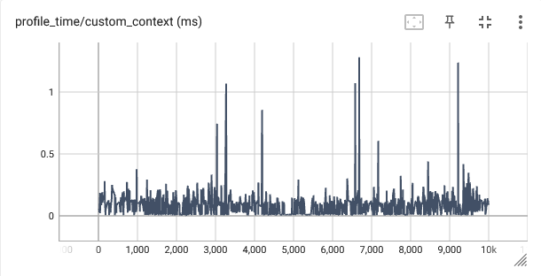
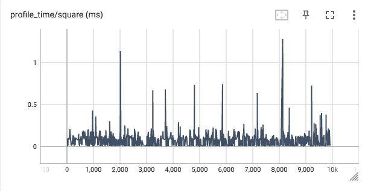

I already described the [mdml-tools](https://codebase.helmholtz.cloud/m-dml/mdml-tools) python library in a 
<a href="../projects/6-mdml-tools">project</a>. In this post I want to show you how to use the profiler of the library
to profile your cuda code and display the results in tensorboard. The reason why we even need a profiler for code run
on the GPU is that standard python profilers like cProfile or line_profiler only work for code that is run on the CPU.

I assume you already know what profiling is and why it is useful. Keep in mind that the profiling itself makes your
code slower, so you should only use it during development and not when training your deep learning model or in 
production.

## How to use the profiler
The profiler comes in two flavors. One is a context manager and the other one is a decorator. The context manager
is useful to profile sections of your code, while the decorator is useful to profile functions and methods.
Under the hood, both use `torch.cuda`, so they can only be used to profile code that is run on the GPU.

### Profiling a section of code

For profiling sections of code we use the `measure_execution_time_context` context manager. It takes a name for the
section as an argument and optionally a function that is called with the measured time as an argument. This function
can be used to log the measured time to a tensorboard. The following example shows how to use it:

```python
import torch
from mdml_tools.utils.profiling import measure_execution_time_context
from torch.utils import tensorboard

tb_logger = tensorboard.SummaryWriter("logs")
data = torch.rand(10000, 1000, device="cuda")
results = []

for i, batch_data in enumerate(data):
    with measure_execution_time_context("custom_context",
                                        experiment_log_func=tb_logger.add_scalar,
                                        global_step=i):
            results.append(batch_data * 2)
```

When you run this code, you will see something like the following output in your tensorboard:



You see how easy it was to get an estimate of the execution time of the code in the context manager. The only thing
you have to do is to wrap the code you want to profile in the context manager and give it a name. The name is used
as the name of the tensorboard summary. If you want to log the measured time to tensorboard, you have to pass a
function that takes the measured time as an argument. In this example, I used the `add_scalar` function of the
tensorboard logger. The `global_step` argument is optional and is used to log the measured time to a specific step
in the tensorboard summary. If you don't pass it, then the profiler uses an internal counter to keep track of the
steps. If you have multiple profilers running at the same time, you should pass the global step to make sure that
the correct step is logged.

### Profiling a function or method

For profiling functions and methods we use the `measure_execution_time` decorator. It makes the code even 
cleaner. It also comes with a neat `bypass` argument, which can be used to bypass the profiler. Especially when
you decorate multiple functions with the profilers this keyword makes it easy to disable the profiler for all
functions at once. The following example shows how to use it:

```python
import torch
from mdml_tools.utils.profiling import measure_execution_time
from torch.utils import tensorboard

tb_logger = tensorboard.SummaryWriter("logs")
data = torch.rand(10000, 1000, device="cuda")
results = []


@measure_execution_time(experiment_log_func=tb_logger.add_scalar, bypass=False)
def square(x):
    return x * x


for i, batch_data in enumerate(data):
    results.append(square(batch_data))
```


The output obviously looks very similar to the output of the context manager. We did not have to specify a name
for the profiler, because the profiler uses the name of the function.
<br>

-----------

<br>
I hope this post was helpful for you. If you have any questions, suggestions or run into any problems, feel free to open
an issue on the [mdml-tools repository](https://codebase.helmholtz.cloud/m-dml/mdml-tools).

<p class="text-center">

</p>