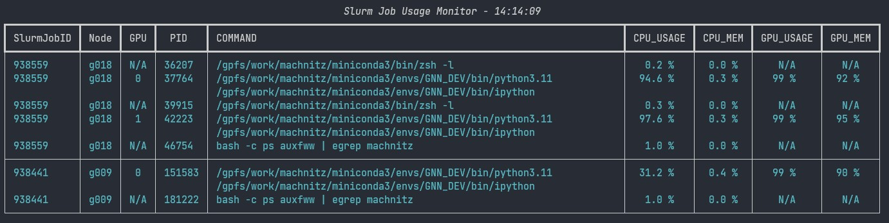

# Slurm Resource Monitor

All the HPC systems I encountered during my short research career so far used the 
[Slurm Workload Manager](https://slurm.schedmd.com/overview.html), which is a very powerful tool for managing the
resources of a cluster. When you are a user of such a system, you can use various commands to get information about
your running jobs, but I did not come across a single one that lets you see the allocated resources of all of your
jobs, like the CPU and GPU usage. This is why I created this tool, which is command line application written completely
in python. 

It finds all the jobs the user is currently running, logs into the nodes and reads the resource usage. Afterward,
it displays the information in a tabular format that can be adjusted by using command line arguments. 

It is very easily installed, because it is available on PyPI. You can install it by running the following command:

```bash
pip install slurm-job-resource-monitor
```

After installation you can run it by typing `slurm_job_resource_monitor` into your terminal from any directory.
I would recommend to group commands with the same name, though, to get a better overview. I usually use it like this:

```bash
slurm_job_monitor --group-by-cmd "sum"
```
This command groups all the jobs that have the same command into one row and sums up the resources.

It is not really a profiling tool but for a first overview of how many resources your programs are using it is very
handy.


<p class="text-center">

</p>