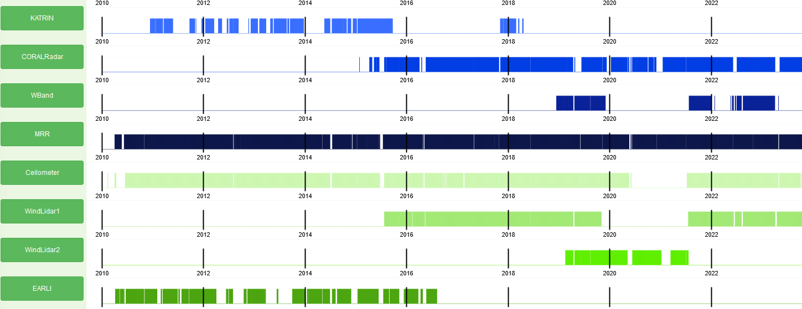

# Device Availability Viewer

The Max Planck Institute for Meteorology has a lot of instruments deployed at a location on the island of Barbados.
These instruments include radars, lidars, ceilometers, and many more. The data of these instruments is used by the
scientists of the institute to study the atmosphere and the weather.

One problem that the scientists face is that the instruments are not always available. They might be offline for
maintenance or because of a malfunction. The overview I created shows the availability of each instruments over time.
It is interactive and allows the user to zoom in and out and to select a time range. This way the user can 
quickly access the availability of the instruments in need. This makes it easier to plan experiments and analyses.



