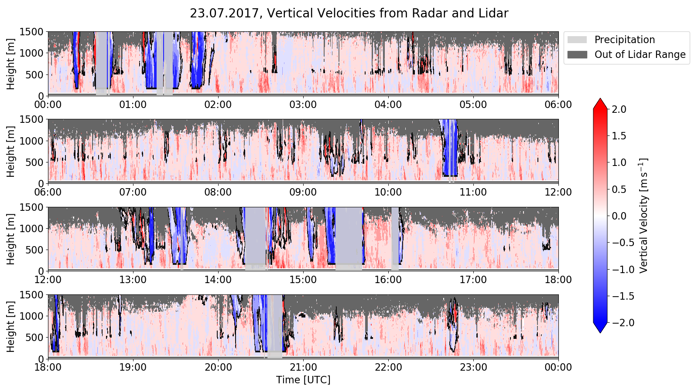

# BCO Python Library

This library was created during my time at the **Max Planck Institute for Meteorology**. It is a python library with 
the purpose of making the measurements data of the institute more accessible to the scientists. The library is used to 
read, process and visualize the data. What makes it especially useful is the possibility to lazily download the data
from the servers of the institute. This makes it possible to work with the data remotely without having to know the
details of the data structure or the location of the data on the servers.

The following notebook shows how easy the process of loading and plotting the data is:

 
 
 
 





