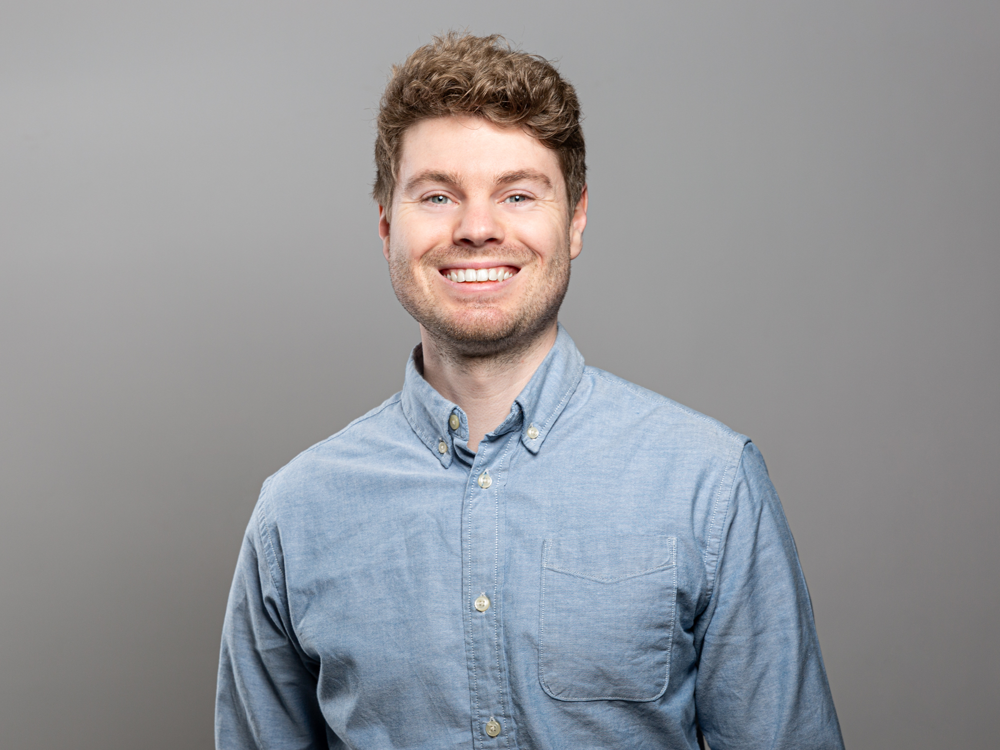

# **About Me**

Hi, I am **{{ site.author.name }}** :wave: 
Currently diving deep into machine learning for my PhD in the 
[model-driven machine learning](http://m-dml.org/) group at the Helmholtz-Zentrum Hereon, near Hamburg, Germany, I find myself at the crossroads of **neural networks** and **earth system sciences**. My quest? To pioneer training methods for **generative neural networks** that refine the statistical accuracy of predictions—both individually and collectively within an ensemble. This matters immensely as it directly influences our confidence in these predictions and, by extension, the decisions we make based on them.

Beyond the core of my research, I'm passionate about **high performance computing**, unveiling stories hidden in data through **visualization**, and tackling the challenges of **big data**. My teammates might say I'm the go-to for coding prowess, seamless project coordination, and bringing new ideas to life with speed and precision.

  






